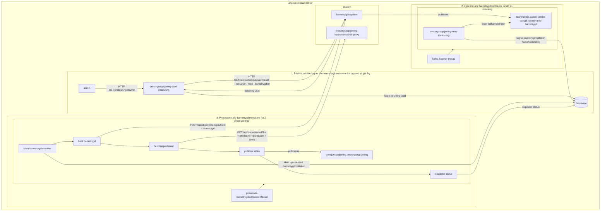

# omsorgsopptjening-start-innlesning
Bestiller overlevering av alle barnetrygdmottakere for et gitt år fra [barnetrygdsystemet](https://github.com/navikt/familie-ba-sak), og innhenter nødvendig grunnlagsdata om barnetrygd og hjepestønad for disse. Data fra kildesystemet transformeres til internt format før det publiseres videre til intern kafkatopic for videre prosessering.

## Kom i gang

Først:
* Sørg for at du er kjent med sideeffektene i nedstrømsapplikasjonene [Arkitektur](#Arkitektur)
* Sørg for at du har konfigurert parameteret `ar` i requesten i nedstrømsapplikasjonene [Arkitektur](#Arkitektur)

Applikasjonen tilbyr endepunktet `GET:/innlesning/start/{ar}` eksponert via ingress `https://omsorgsopptjening-start-innlesning.intern.[dev|prod].nav.no`. 

1. Naviger til url i nettleser
2. Dersom man ikke allrede er logget inn vil man redirectes til innlogging
   1. For `prod-gcp` logg inn med din @nav.no bruker
   2. For `dev-gcp` logg inn med din @trygdeetaten.no bruker
3. Etter innlogging skal man sendes tilbake til url fra 2.
4. Returnert `uuid` er identifikator for innlesingen som er bestilt

## Arkitektur

[Overordnet arkitektur omsorgsopptjening](https://confluence.adeo.no/x/Gl_qHg)

Applikasjonsflyten baserer seg på følgende overordnede steg:

1. Bestille publisering av alle barnetrygdmottakere fra og med et gitt år
2. Lese inn alle barnetrygdmottakere bestilt i 1.
3. Prosessere alle barnetrygdmottakere fra 2.

## Intern arkitektur:

### 1. Bestille publisering av alle barnetrygdmottakere fra og med et gitt år

`BarnetrygdInnlesing` gjennomføres ved å kalle barnetrygdsystemet for å signalisere at vi ønsker at alle `Barnetrygdmottaker` fra og med en gitt dato skal publiseres på kafka.

### 2. Lese inn alle barnetrygdmottakere bestilt i 1.

Alle `BarnetrygdmottakerMelding` på kafka leses inn og persisteres i databasen.

Det er lagt inn 2 mekanismer for at vi skal være sikre på at vi får lest alle meldingene fra kafka:

* Barnetrygdsystemet markerer start/slutt for en bestemt forsendelse identifisert av en id
* Dersom en melding i forsendelsen ikke lar seg prosessere, invalideres hele forsendelsen med aktuell id
    * I praksis innebærer dette at hele forsendelsen og alle tilknyttede meldinger forkastes (slettes i db), påfølgende
      meldinger for samme forsendelse vil ignorerers.

#### Feilhåndtering

Dersom feil oppstår og en `BarnetrygdInnlesing` forkastes, er det meningen at man forsøker en ny innlesing fra start.

### 3. Prosessere alle barnetrygdmottakere fra 2.

Når en innlesning fra forrige steg er ansett for å være fullført (alle barnetrygdmottakere lest uten feil) prosesseres
barnetrygdmottakerne
fra innlesningen ved å hente én etter én fra databasen. For hver barnetrygdmottaker hentes det detaljert informasjon om
barnetrygd
og hjelpestønad som deretter publiseres på kafka.

#### Transaksjonshåndtering

Prosesseringen av hver barnetrygdmottaker er designet for å understøtte følgende:

* Muliggjøre oppdatering av status når feil oppstår
  * Oppnås ved å gjennomføre prosesseringen og feilhåndteringen i to separate transaksjoner. Siden både vellykket prosessering og feilhåndtering forsøker å oppdatere den samme statustabellen er det nødvendig at transaksjonen for prosessering får committet eller rullet tilbake før feilhåndteringen gjennomføres - noe annet kan ende med deadlock.
* Muliggjøre distribuert prosessering på tvers av flere podder
  * Spørringen som henter rader for prosessering vil låse raden som velges ut for varigheten av transaksjonen. Spørringen vil også hoppe over eventuelle rader som allrered er låst, slik at andre podder ikke vil plukke opp samme rad. Kombinasjonen av disse to er årsaken til at prosesseringen og feilhåndteringen kjøres som egne transaksjoner innenfor levetiden til transaksjonen som hentet raden. Merk at det er viktig at hver av transaksjonene oppretter en ny transaksjon `PROPAGATION_REQUIRES_NEW`. 
* I størst mulig grad holde datatabasen i synk med resultatet fra eksterne kall

#### Feilhåndtering

Dersom det oppstår feil under prosesseringen (exception kastes) vil statusen for den aktuelle barnetrygdmottakeren
oppdateres, og den aktuelle barnetrygdmottakeren vil havne i karantene for videre prosessering (for å unngå at feil
blokkerer prosesseringen av andre barnetrygdmottakere). Etter at karantenetiden er utløpt, vil raden forsøkes på nytt x
antall ganger opp til et maksimum - når maksimum er nådd uten at raden er prosessert ferdig, vil statusen settes til `Feilet`
og det vil være behov for manuell intervensjon.

#### Administrasjonsgrensesnitt

Et administrasjonsgrensesnitt er tilgjengelig på:

* Produksjon: 
  * https://omsorgsopptjening-start-innlesning.intern.nav.no/

* Test: 
  * https://omsorgsopptjening-start-innlesning.intern.dev.nav.no/

Foreløpig er kun to operasjoner tilgjengelig der. Man kan enten stoppe
eller avslutte en behandling. Forskjellen på de to er at en stoppet behandling
ikke regnes som ferdig, og dermed vil overvåking fortsatt kunne varsle på
at innlesingen ikke er ferdig prosessert. Avsluttet betyr derimot at barnetrygdmottakeren
regnes som ferdig prosessert, selv om denne prosesseringen resultere i feil.

Videre informasjon om tilgjengelige operasjoner og hvordan de brukes ligger
i hjelpeteksten i  grensesnittet.

## Lokalt oppsett
Start docker daemon eller colima

## Colima trouble?
1) Setting the DOCKER_HOST environment variable to point to Colima socket.
export DOCKER_HOST="unix://${HOME}/.colima/default/docker.sock"

2) Linking the Colima socket to the default socket path. Note that this may break other Docker servers.
sudo ln -sf $HOME/.colima/default/docker.sock /var/run/docker.sock
3) Linking colima test container socket
export TESTCONTAINERS_DOCKER_SOCKET_OVERRIDE=/var/run/docker.sock
